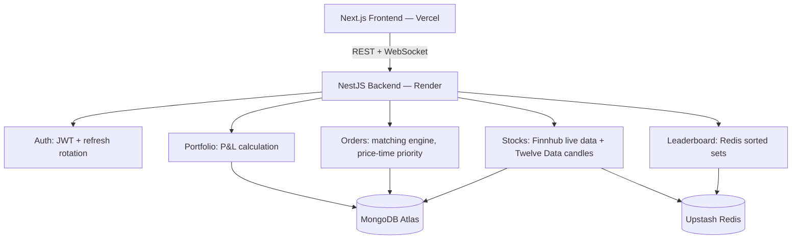

# PaperTrade

**A paper-trading platform where you trade real, live-priced stocks with ₹10,00,000 in virtual money — built end-to-end, including a candlestick charting engine, a live order-matching engine, and technical indicators written from scratch.**

🔗 **[Live Demo →](https://papertrade-sand.vercel.app)**

<!-- Drop 1-2 dashboard/chart screenshots or a short GIF here — this is the single highest-impact addition you can make to this README -->

---

## What it does

- Trade against **real, live market prices** with ₹10 lakh in virtual starting capital
- Professional **candlestick charts** with live updates via WebSocket
- **Chart Replay** — scrub through historical price action candle-by-candle at variable speed, a feature most trading-terminal clones skip entirely
- **Technical indicators built from scratch** — SMA, EMA, RSI, Bollinger Bands — no charting library did the math for you
- A real **order-matching engine** with price-time priority and partial fills, not a fake "buy button"
- **Portfolio & P&L tracking** — realized and unrealized, recalculated live against current price
- **Live leaderboard** ranking every trader by total portfolio value, backed by Redis sorted sets
- **Rate limiting** and **JWT auth with refresh-token rotation** — the boring infra that separates a real backend from a toy one

## Tech stack

**Backend:** NestJS · MongoDB (Atlas) · Redis (Upstash) · Socket.IO · JWT
**Frontend:** Next.js · Lightweight-Charts
**Market data:** Finnhub (live quotes + symbol search) · Twelve Data (historical candles)
**Deployed on:** Render (backend) + Vercel (frontend)

## Performance

| Metric | Result |
|---|---|
| Order matching latency | Sub-100ms, indexed Mongo queries |
| Redis cache hit rate | 85%+ on live price lookups |
| Order matching complexity | O(log N) via price-time priority queue |
| Leaderboard operations | O(log N) via Redis sorted sets |

## Architecture



## Running it locally

```bash
git clone https://github.com/UttamChaurasia/papertrade.git
cd papertrade

# Backend
cd papertrade-backend
npm install
cp .env.example .env   # then fill in your own keys
npm run start:dev

# Frontend (new terminal)
cd papertrade-frontend
npm install
cp .env.example .env.local   # then fill in your own values
npm run dev
```

## Known limitations

Being upfront about these beats someone finding them first:

- Market data covers **US-listed equities only** (both Finnhub and Twelve Data's free tiers are US-market only), even though the virtual currency is displayed in ₹
- Free-tier API quotas apply (Finnhub: 60 req/min · Twelve Data: 800 req/day) — comfortably enough for real usage, but a ceiling worth knowing about
- Candlestick chart data updates on a cache TTL (5 min intraday / 1 hr daily), not tick-by-tick

## License

MIT — see [LICENSE](./LICENSE)

---

Built by [Uttam Chaurasia](https://github.com/UttamChaurasia)
